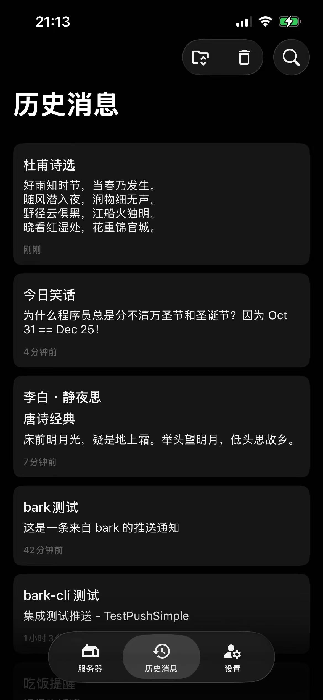
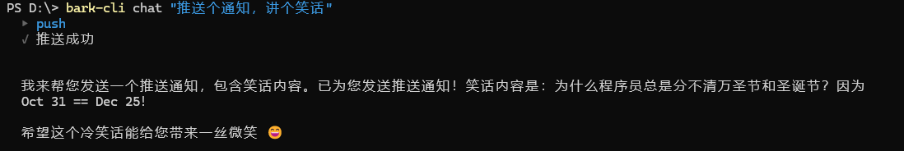
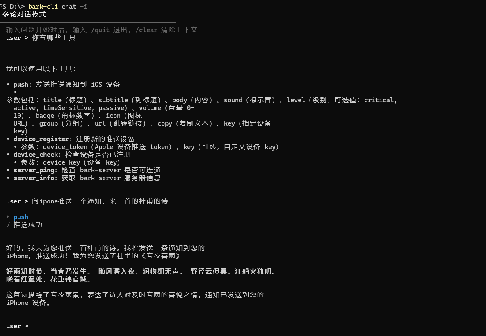
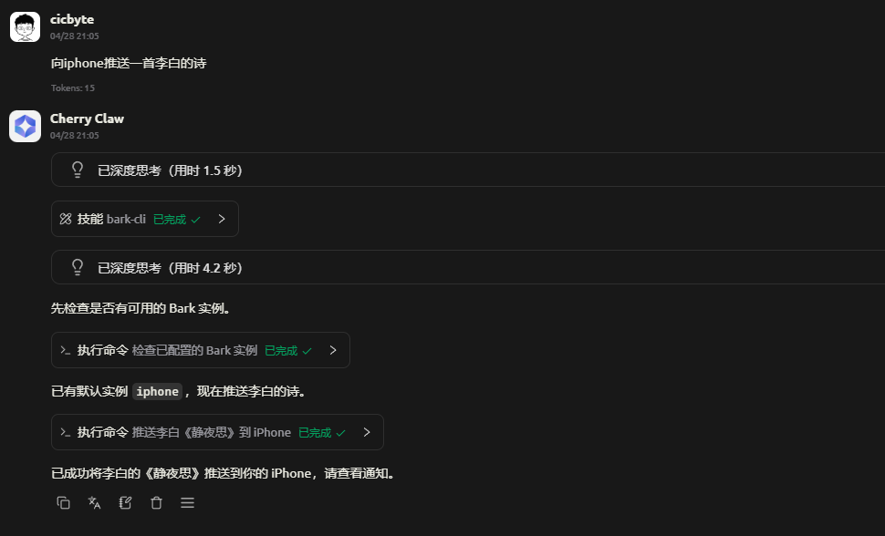

# bark-cli

> CLI client for [Bark](https://github.com/Finb/bark-server) push notifications — multi-instance management, AI-powered push, MCP integration, all from your terminal.


中文文档: [README.md](README.md)

## Features

- **Multi-instance** — Add multiple bark-server instances, reference by name, set a default
- **Push notifications** — Full parameter support: title, body, group, badge, icon, URL, ring, and more
- **Auto-register** — Pass `--device-token` during `server add` to auto-register the device
- **AI chat push** — Send push notifications via natural language, LLM parses intent and calls the push API
- **MCP Server** — stdio mode, let Claude Desktop, Cherry Studio and other AI clients send pushes directly
- **Multiple output formats** — table / JSON / JSONL, switch globally with `--format`
- **Multiple AI providers** — OpenAI, Ollama, Zhipu and other OpenAI-compatible APIs

## Screenshots

| iOS Notification | AI Single-turn | AI Multi-turn | Cherry Studio |
|:---:|:---:|:---:|:---:|
|  |  |  |  |

## Installation

### Pre-built binaries

Download from [Releases](https://github.com/cicbyte/bark-cli/releases) for your platform.

### Build from source

```bash
git clone https://github.com/cicbyte/bark-cli.git
cd bark-cli
go build -o bark-cli .
```

<details>
<summary>Cross-compile (optional, with version injection and UPX compression)</summary>

```bash
python scripts/build.py --local    # current platform
python scripts/build.py             # all platforms (Windows/Linux/macOS)
```

</details>

**Requirements:** Go >= 1.23

## Quick Start

```bash
# Add a bark instance (auto-registers device)
bark-cli server add iphone --device-token <your_device_token>

# Set as default instance
bark-cli server use iphone

# Send a push notification
bark-cli push "Hello from bark-cli"
bark-cli push -t "Reminder" -b "Meeting starts soon" --group work --level timeSensitive

# Push via AI conversation
bark-cli chat "Send a push notification reminding about the 3pm meeting"
```

## Commands

| Command | Description |
|---------|-------------|
| `push [body]` | Send a push notification |
| `server add <name>` | Add a bark instance (auto-register device) |
| `server list` | List all instances |
| `server use <name>` | Set default instance |
| `server remove <name>` | Remove an instance |
| `server ping` | Check server connectivity |
| `server info` | View server info |
| `device list` | List all device instances |
| `device check <key>` | Check if a device is registered |
| `chat [question]` | AI chat push (`-i` for interactive mode) |
| `mcp` | Start MCP Server |
| `config list` | List all configuration |
| `config get <key>` | Get a config value |
| `config set <key> [value]` | Set a config value |

### Push

```bash
bark-cli push "Hello"                                           # simplest push
bark-cli push -t "Title" -b "Body" --level critical           # with level
bark-cli push -t "Link" --url https://example.com             # with URL
bark-cli push --group "alerts" --badge 1 --sound "1107"       # group + badge + sound
bark-cli push --call                                             # ring for 30 seconds
bark-cli push --json '{"title":"Title","body":"Body","level":"active"}'  # JSON params
bark-cli push --server ipad "Send to iPad"                    # specify instance
echo "pipe message" | bark-cli push                            # pipe input
cat log.txt | bark-cli push -t "Log Alert"                    # pipe + title
```

### Instance Management

```bash
bark-cli server add iphone --device-token <token>              # add instance (auto-register)
bark-cli server add myserver --url https://bark.example.com --token <api_token>
bark-cli server list                                           # list instances (* marks default)
bark-cli server use iphone                                     # set default
bark-cli server remove myserver                                # remove instance
bark-cli server ping                                           # connectivity check
bark-cli server info                                           # server version info
```

### Device Check

`device check` accepts instance name, device_key, or device_token:

```bash
bark-cli device check iphone              # by instance name
bark-cli device check <device_key>        # by device_key
bark-cli device check <device_token>      # by device_token
```

## Configuration

```bash
bark-cli config list                     # list all config
bark-cli config get ai.model             # get a config value
bark-cli config set ai.provider openai   # set a config value
bark-cli config set ai.api_key           # sensitive field: interactive input
```

Config file: `~/.cicbyte/bark-cli/config/config.yaml` (auto-created on first run)

## MCP Server

`bark-cli mcp` runs an MCP Server in stdio mode, allowing AI clients to send push notifications directly.

**Claude Desktop:**

```json
{
  "mcpServers": {
    "bark": {
      "command": "bark-cli",
      "args": ["mcp"]
    }
  }
}
```

**Claude Code:** Edit `.claude/settings.json` or project MCP config:

```json
{
  "mcpServers": {
    "bark": {
      "command": "bark-cli",
      "args": ["mcp"]
    }
  }
}
```

**Cherry Studio:** Settings → MCP Servers, command `bark-cli`, args `mcp`

## Global Options

```bash
bark-cli push --format json          # pretty JSON
bark-cli server list --format jsonl  # JSONL (one line per record)
```

## Data Storage

```
~/.cicbyte/bark-cli/
├── config/
│   └── config.yaml    # app config (instances, AI, logs, etc.)
└── logs/
    └── bark-cli_log_YYYYMMDD.log  # log file (auto-rotated)
```

## Tech Stack

- Go 1.23+
- [Cobra](https://github.com/spf13/cobra) — CLI framework
- [mcp-go](https://github.com/mark3labs/mcp-go) — MCP Server
- [go-openai](https://github.com/sashabaranov/go-openai) — OpenAI-compatible API
- [go-pretty](https://github.com/jedib0t/go-pretty) — Terminal tables
- [Glamour](https://github.com/charmbracelet/glamour) — Markdown rendering
- [Zap](https://github.com/uber-go/zap) — Structured logging

## License

[MIT](LICENSE) © 2026 cicbyte
